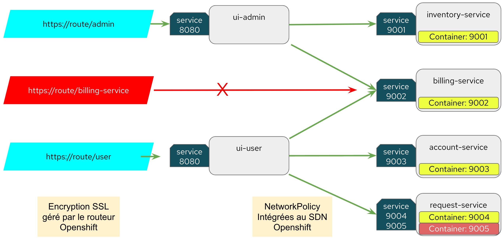

# Sécurité réseau avec NetworkPolicy

### Topologie



### 1 - Déployer l'ensemble des ressources du répertoire manifests manuellement ou à l'aide de ACM 

L'image de l'application de test est automatiquement bâtie avec s2i. Attendre que le build soit terminé et que les Pods puissent consommer l'image. 

### 2 - Vérifier la liste des routes et vérifier que les accès sont fonctionnels. 

Exemple: ( le FQDN doit être ajusté en fonction de votre environnement )

#### Liste des routes
```
oc get route
NAME              HOST/PORT                                                                            PATH   SERVICES          PORT   TERMINATION     WILDCARD
billing-service   billing-service-integrations-networkpolicy.apps.dev-sandbox-flgwm.azmouimetlab.com   /      billing-service   9002   edge/Redirect   None
ui-admin          ui-admin-integrations-networkpolicy.apps.dev-sandbox-flgwm.azmouimetlab.com          /      ui-admin          8080   edge/Redirect   None
ui-user           ui-user-integrations-networkpolicy.apps.dev-sandbox-flgwm.azmouimetlab.com           /      ui-user           8080   edge/Redirect   None
```

#### Tester l'accès aux routes UI user et UI admin
```
curl https://ui-user-integrations-networkpolicy.apps.dev-sandbox-flgwm.azmouimetlab.com --insecure
{"hostname":"ui-user-6df9fbb747-zgs45","status":"ok"}

curl https://ui-admin-integrations-networkpolicy.apps.dev-sandbox-flgwm.azmouimetlab.com --insecure
{"hostname":"ui-admin-79b8bc8557-scpnf","status":"ok"}
```

#### Tester l'accès à la route Leak

La route pointe directement sur le service billing et qui ouvre potentiellement une brèche de sécurité.

```
curl https://billing-service-integrations-networkpolicy.apps.dev-sandbox-flgwm.azmouimetlab.com --insecure
{"hostname":"billing-service-76cbf84dd8-nswv7","status":"ok"}
```

### 3 - Vérifier les accès inter-pods

Connecter en terminal (Console ou rsh) à n'importe quel Pod (UI ou service) et tester la connectivité vers les autres Pods. 

Un script de test est inclus dans l'image. 

```
oc rsh account-service-7b448f74b-hpcfg

(app-root) sh-4.4$ ./test-access.sh
Test: connexion vers service inventory-service port 9001
{"hostname":"inventory-service-78c5f7d984-6jkpc","status":"ok"}
Test: connexion vers service billing-service port 9002
{"hostname":"billing-service-76cbf84dd8-nswv7","status":"ok"}
Test: connexion vers service account-service port 9003
{"hostname":"account-service-7b448f74b-hpcfg","status":"ok"}
Test: connexion vers service request-service port 9004
{"hostname":"request-service-544fc84544-8j2lc","status":"ok"}
Test: connexion vers service request-service port 9005
{"hostname":"request-service-544fc84544-8j2lc","status":"ok"}
```

À noter que tous les Pods peuvent communiquer entre eux. 


### 4 - Fermer tous les accès réseau au projet

```
oc apply -f networkpolicy/default-deny.yaml
```

Revérifier l'accès aux routes à l'aide des commandes curl précédentes. À noter qu'aucun service n'est maintenant disponible. 

### 5 - Autoriser l'accès aux UI user et admin uniquement

```
oc apply -f networkpolicy/ingresspolicy.yaml
``` 

Revérifier l'accès aux routes à l'aide des commandes curl précédentes. À noter que seuls les UI user et admin sont maintenant accessibles. Le service billing n'est plus accessible de l'externe. 

### 6 - Autoriser les services à communiquer entre eux selon la topologie

À ce stade, les Pods UI n'ont accès à aucun service à cause du default-deny. Pour vérifier 

```
oc rsh account-service-7b448f74b-hpcfg sh /opt/app-root/src/test-access.sh

Test: connexion vers service inventory-service port 9001
curl: (28) Connection timed out after 5001 milliseconds
Test: connexion vers service billing-service port 9002
curl: (28) Connection timed out after 5001 milliseconds
Test: connexion vers service account-service port 9003
{"hostname":"account-service-7b448f74b-hpcfg","status":"ok"}
Test: connexion vers service request-service port 9004
curl: (28) Connection timed out after 5001 milliseconds
Test: connexion vers service request-service port 9005
curl: (28) Connection timed out after 5001 milliseconds
```

Appliquer tous les autres NetworkPolicy

```
oc apply -f networkpolicy/          
networkpolicy.networking.k8s.io/allow-ui-admin-to-billing-service created
networkpolicy.networking.k8s.io/allow-ui-admin-to-inventory-service created
networkpolicy.networking.k8s.io/allow-ui-user-to-account-service created
networkpolicy.networking.k8s.io/allow-ui-user-to-request-service created
networkpolicy.networking.k8s.io/deny-by-default configured
networkpolicy.networking.k8s.io/allow-from-openshift-ingress unchanged
```

### 7 - Vérifier l'ensemble de la topologie

Connecter en terminal à chaque Pods afin de vérifier que la topologie est bien respectée.

Tous les Pods Service ne peuvent pas communiquer entre eux.

```
oc rsh account-service-7b448f74b-hpcfg sh /opt/app-root/src/test-access.sh

Test: connexion vers service inventory-service port 9001
curl: (28) Connection timed out after 5000 milliseconds
Test: connexion vers service billing-service port 9002
curl: (28) Connection timed out after 5001 milliseconds
Test: connexion vers service account-service port 9003
{"hostname":"account-service-7b448f74b-hpcfg","status":"ok"}
Test: connexion vers service request-service port 9004
curl: (28) Connection timed out after 5000 milliseconds
Test: connexion vers service request-service port 9005
curl: (28) Connection timed out after 5000 milliseconds
```

Le Pod UI-Admin peut communiquer avec Inventory et Billing uniquement

```
oc rsh ui-admin-79b8bc8557-scpnf sh /opt/app-root/src/test-access.sh

Test: connexion vers service inventory-service port 9001
{"hostname":"inventory-service-78c5f7d984-6jkpc","status":"ok"}
Test: connexion vers service billing-service port 9002
{"hostname":"billing-service-76cbf84dd8-nswv7","status":"ok"}
Test: connexion vers service account-service port 9003
curl: (28) Connection timed out after 5001 milliseconds
Test: connexion vers service request-service port 9004
curl: (28) Connection timed out after 5001 milliseconds
Test: connexion vers service request-service port 9005
curl: (28) Connection timed out after 5001 milliseconds
```

Le Pod UI-User peut communiquer avec Billing, Account et Request uniquement

À noter que le Pod Request expose le port 9005 qui ne fait pas partie de la topologie voulu. 

Vérifier le deploiement de Request dans manifests/deployments/request-service-deploy.yaml et noter le conteneur nommé tmp-dev-test qui semble être un oublie de la part du développeur. 

```
        - name: tmp-dev-test
          image: pythonapp:v1
          env:
            - name: LISTEN_PORT
              value: "9005"
          resources:
            requests:
              cpu: 200m
              memory: 256Mi
            limits:
              cpu: 400m
              memory: 512Mi
          ports:
            - containerPort: 9005
```

Les NetworkPolicy permettent d'éviter que de pareilles erreurs ne soient exploitées. 

### 8 - Contrôler l'accès des Pods vers le monde extérieur

Il est possible de restreindre l'accès d'un projet vers les ressources externes. Le contrôle peut s'effectuer avec des adresses IP spécifiques, des bloques CIDR ou encore des adresses DNS. 

```
oc apply -f egress-networkpolicy/egress-network-policy.yaml
```

Vérifier la connection à divers sites 

Exemple: www.google.com

```
oc rsh ui-user-6df9fbb747-zgs45 curl http://www.google.com -v 
* Rebuilt URL to: http://www.google.com/
*   Trying 172.217.13.164...
* TCP_NODELAY set
*   Trying 2607:f8b0:4020:806::2004...
* TCP_NODELAY set
* Immediate connect fail for 2607:f8b0:4020:806::2004: Network is unreachable
```

Exemple: www.redhat.com (site permit par le EgressNetworkPolicy)

```
oc rsh ui-user-6df9fbb747-zgs45 curl http://www.redhat.com -v 
* Rebuilt URL to: http://www.redhat.com/
*   Trying 96.16.40.103...
* TCP_NODELAY set
* Connected to www.redhat.com (96.16.40.103) port 80
```

Exemple: 142.44.140.12 (Adresse IP permise par le EgressNetworkPolicy)

```
oc rsh ui-user-6df9fbb747-zgs45 curl http://142.44.140.12 -v  
* Rebuilt URL to: http://142.44.140.12/
*   Trying 142.44.140.12...
* TCP_NODELAY set
* Connected to 142.44.140.12 (142.44.140.12) port 80
```

